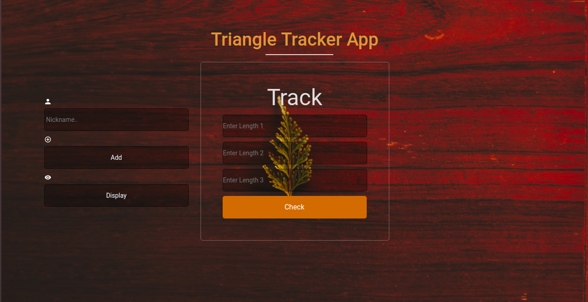

# {Traingle Tracker}
#### {This simple application is tracking app on the type of triangle a user requests to see.}, {2019,June}
#### By **{Davis Wafula}**
## Description
A user enters his nickname ad requests to view it as an added member and then enters
three values of triangle sides and in return a confirmattion of whether it is indeed a triangle and if accepted the type of the triangle is alerted. }
## Setup/Installation Requirements
* Load the gh-pages and ave a view on your favorite web browser.

## Known Bugs
Some of scalene values may alternate like in the case of 9,4,3 values.
## Technologies Used
####HTML 
* used html as a skeleton for the inputs and buttons.
####CSS
* Styled the HTML with css by adding some media queries, hover effects. 
####Javascript
* Here the logic and base of the app is dealt with. Functions with if else statements and array functions also include to store the nickname of the user.

## Support and contact details
 Email me!! davisdavy96@gmail.com
### License
MIT License

Copyright (c) [2019] [fullname]

Permission is hereby granted, free of charge, to any person obtaining a copy
of this software and associated documentation files (the "Software"), to deal
in the Software without restriction, including without limitation the rights
to use, copy, modify, merge, publish, distribute, sublicense, and/or sell
copies of the Software, and to permit persons to whom the Software is
furnished to do so, subject to the following conditions:

The above copyright notice and this permission notice shall be included in all
copies or substantial portions of the Software.

THE SOFTWARE IS PROVIDED "AS IS", WITHOUT WARRANTY OF ANY KIND, EXPRESS OR
IMPLIED, INCLUDING BUT NOT LIMITED TO THE WARRANTIES OF MERCHANTABILITY,
FITNESS FOR A PARTICULAR PURPOSE AND NONINFRINGEMENT. IN NO EVENT SHALL THE
AUTHORS OR COPYRIGHT HOLDERS BE LIABLE FOR ANY CLAIM, DAMAGES OR OTHER
LIABILITY, WHETHER IN AN ACTION OF CONTRACT, TORT OR OTHERWISE, ARISING FROM,
OUT OF OR IN CONNECTION WITH THE SOFTWARE OR THE USE OR OTHER DEALINGS IN THE
SOFTWARE.